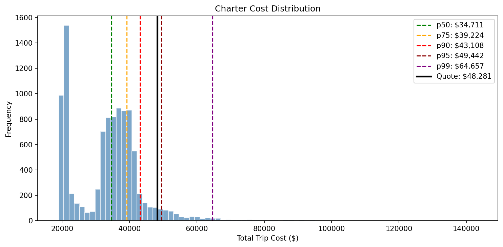
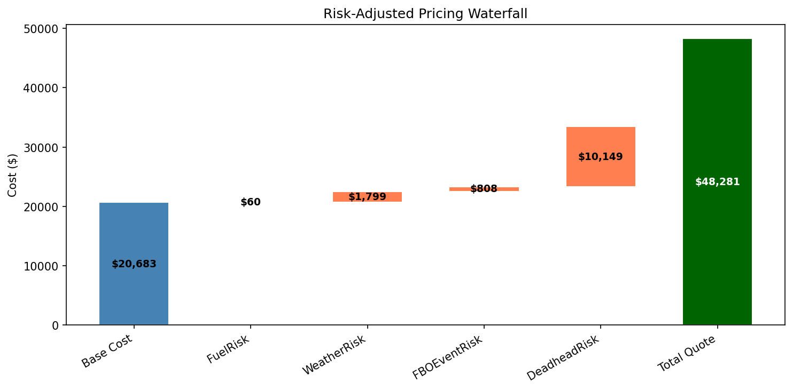

# charter-shield

**Monte Carlo pricing engine for fixed-price charter aviation contracts**

Charter quotes are point estimates — actual costs are distributions. This engine models the stochastic risk factors that cause cost overruns and produces risk-adjusted fixed prices at configurable confidence levels.

## The Problem

When aviation operators commit to fixed-price contracts (e.g. for collegiate athletic travel), they absorb all variance between quoted and actual costs. Four risk factors drive this variance:

| Risk Factor | What It Models | Typical Impact |
|---|---|---|
| **Fuel** | Spot price volatility, FBO markup, flowage fees | $0 – $2,500 |
| **Weather** | ATC delays, holding patterns, diversions | $0 – $25,000+ |
| **FBO Events** | Special event surcharges (NFL, NCAA, PGA) | $0 – $30,000 |
| **Deadhead** | Empty repositioning legs | $0 – $20,000 |

## How It Works

The engine runs 10,000 Monte Carlo simulations per trip, sampling from calibrated distributions for each risk factor, and outputs a full cost distribution with percentiles.

### Cost Distribution

### Risk Waterfall

## Configuration

All parameters are tunable via `config.toml` — no hardcoded values in the engine.

## License

MIT
